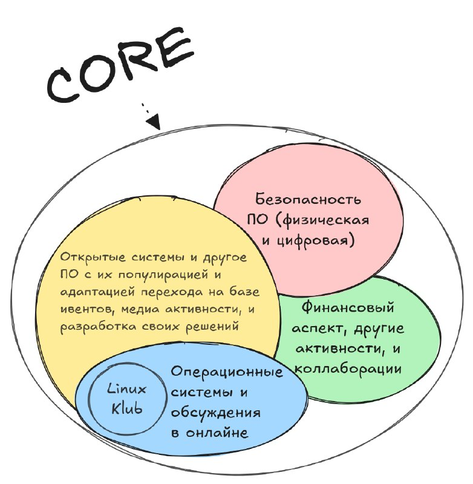
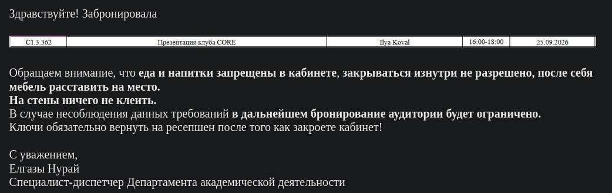

# Handbook

## Рабочий цикл активности

1. Создать задачу в [operations.md](operations.md) и назначить ответственного.
2. Зафиксировать цель, формат, дату, аудиторию и необходимые ресурсы.
3. До публикации проверить площадку, разрешения, бюджет и согласия на съёмку.
4. После активности добавить результаты и подтверждения в течение 7 дней.
5. На ежемесячной ретроспективе закрыть задачу или записать следующий шаг.

## Отчетность для ДСВР в AITU

В конце каждого месяца (примерно под 30-ое число), мы подаем отчетность деятельности клуба за текущий месяц для ДСВР в AITU, показывая нашу общую активность как сообщества и прозрачность процессов. Примерный формат указан ниже:

```
Отчет за <месяц год> для ДСВР
CORE в Astana IT University

Мероприятие / Событие: <краткое название>
Описание: <около 150-300 слов>
Дата проведения: <день.месяц.год>
Результаты: <кол-во участников, основная польза и импакт, другие примерные качественные и количественные результаты>
Подтверждения: <приложенные медиаматериалы как фото или ссылки на публикации (видео, посты, и другое)>

и перечисление других активностей сообщества за текущий месяц...
```

## Краткий манифест сообщества

Ранее мы провели ребрендинг Linux Klub в CORE с целью расширения горизонтов, затрагивая не только ОС сферу, а продвигать сообщество про open systems (открытое ПО, IT системы, и AI в том числе) во всем Казахстане:
- Мы хотим показать, что есть разные формы open source и то что это не про "бесплатно" а про transparency. Например, некоторые компании придерживаются open core, где одна часть системы открыта а другая нет, что позволяет им зарабатывать на этом. Базовый пример это trezor или тот же flipper zero, в которых firmware и схемы открытые то есть кто угодно может собрать собственный device, но также продаются готовые и уже заранее проверенные устройства для тех кто доверяют производителю или для common audience.
- Финальная цель клуба выйти за пределы университета и стать независимыми с собственной финансовой моделью заработка для каждого участника сообщества из staff, но на это требуется отдача каждого участника, что пока на слабом уровне. В идеале, нам нужна отдельная Open Source Foundation из Linux Klub или какая-та независимая организация, которая может консультировать другие компании (b2b), а более того продвигать и проводить тренинги по open-source для обычного населения (b2c). Пока что первичная задача это раскрытиться и быть на слуху за счет общественного просвещения (презентации со специалистами, записи докладов и видео как cybernews, публикации и активности в онлайне, и другое). Нам необходима поддержка от других организаций, что пока тоже нету, ведь ШКБ не хотят помогать в целом и предоставлять собственную инфраструктуру для хакатонов.
- Также, в наше время важно затрагивать момент про digital independence как та же Европа переходит на отечественное и открытое ПО, чтобы не быть под влиянием Америки и других стран. Например, пытаться делать видео кейсы перехода простых обывателей как родителей студентов или наоборот школьников на linux как "челендж неделю на linux после windows", чтобы другие лучше понимали основные проблемы и трудности с которыми приходится сталкиваться. Потом это можно продолжать и до самих униковских компьютеров, пытаться продвинуть ректору и администрации о переходе на linux. Понятное дело это будет слабо получаться в начале (учитывая что мы в аиту то тут слабо слышат мнение людей даже из штата), поэтому на одном аиту останавливаться мало. То есть, нам необходимо еще делать разработку различных практических проектов и создание отечественного ПО, где кто угодно может отдать или интегрировать свои проекты под клуб или упоминать причастность своего проекта к сообществу. Пока на горизонте есть несколько проектов которые можно активно вести это внутренний тг-бот для шкб, ресерч про токенизацию pypi платформы с проактивной безопасностью, и национальных репозиториев ПО.



## Проведение активностей

### Бронирование кабинета или аудитории в AITU

Если активность проводится внутри AITU университета, то необходимо заранее забронировать кабинет за 2 и более дней минимум на outlook почту Nuray Yelgazy с данными деталями:
```
Дата: <день.месяц.год>
Время: <не более 3 часов длительности>
Цель бронирования: <например, "клубная деятельность CORE" с описанием мероприятия и примерного кол-ва человек>
Номер телефона: ... 
Barcode: ...
```

После этого необходимо ожидать пока ответят и выдадут определенный кабинет из возможных (на выбор не дают), а само его нахождение можно проверить в https://yuujiso.github.io/aitumap/.



### Оповещение и подготовка

План примерных предстоящих событий будет храниться в отдельном документе на текущий год и описан еще в operations.md. Для каждого такого события и активности необходима базовая подготовка по регламенту: примерная дата проведения, сценарий или же содержание, формат, тема, аудитория, спикера или ответственного, и контакты. Можно проводить различные активности вне указанных форматов - все что угодно лишь бы привлечь внимание к сообществу и повысить его статус у обывателей и местных специалистов.

Перед анонсированием события необходимо подготовить стилизованные постеры в разных форматах (A4 для печати и изображения в соц. сети которые ведутся в `design` репозитории). Желательно активно использовать GenAI на всех этапах подготовки для ускорения процессов формирование наработок и проверки качества.

Далее важно анонсировать и репостить информацию в структурированном виде через медиаресурсы CORE, AITUSA, и других партнеров:
```markdown
Приложенный постер как изображение

Название события или интро для хука с указанием что именно это CORE проводит

Содержание и описание (формат, дата, место, спикеры, как участовать, детали про клуб немного если возможно для понимания аудитории)

Ссылки на наши другие ресурсы
```

Плакаты в университете размещаются только в разрешённых местах. Перед
размещением нужно уточнить актуальные правила у ДСВР, а после мероприятия
своевременно убрать материалы.

### Запись события и завершение

Во время события такого как доклад обязательно проводить съемку видео, а в любых других случаях достаточно фото или скриншота. У нас пока нету регулярного проф. оборудования, поэтому используем 2 телефона с достаточным кол-вом хранилища (одни для съемки на триноге самого спикера и слушателей, а второй для записи голоса спикера): начинают запись с обоих устройств и делают хлопок чтобы синхронизовать дорожки на монтаже. Далее снятые материалы обрабатываются в итоговый пост о результатах события и видеозапись (ориентировочно 1-2 недели).
