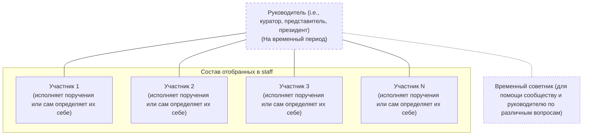

# Staff

## Структура управления

Это тестовая модель на 2026–2027 учебный год. Она может измениться после
ретроспективы и обратной связи staff. Долгосрочная цель — развить CORE за
пределами университета, сохранив прозрачность решений, накопленные ресурсы и
возможность для участников самостоятельно предлагать и вести инициативы.



## Отбор участников

Набор открыт постоянно и состоит из двух этапов: заявки и короткого
собеседования. Вопросы заявки должны помогать понять интересы, доступное время
и предполагаемый вклад, а не собирать лишние персональные данные:
```
Имя или предпочтительное обращение
Учебная группа (если применимо)
Какой вклад вы хотите сделать
Какие идеи готовы проверить на практике
Удобный способ связи
```

После вступления участник проходит испытательный период: предлагает небольшую
инициативу или берёт конкретную задачу, фиксирует результат и получает
обратную связь. Неактивность сначала обсуждается лично; исключение из staff —
крайняя мера, принимаемая прозрачно и без публичного разглашения причин.

## Участники и их вклад

Постоянных должностей нет: участник может совмещать исследования,
организацию событий, медиаконтент и другие направления. Для каждой активности
нужно сохранить дату, результат, ответственного и подтверждение (ссылку,
фото или файл). Подробные персональные сведения и внутреннюю оценку вклада
следует хранить не в публичном GitHub, а в отдельной системе с ограниченным
доступом.

| Участник | Зона ответственности и деятельности | Статус и история | Публичные контакты |
| --- | --- | --- | --- |
| Ilya K. | Исполняет обязанности "президента" клуба с 2026 по 2027 года. | Активен | @doesnm
| Noyan T. | Выполняет роль советника/помощника и ведет совместную работу с Ilya K. | Активен | @noyantendikov |
| Matvey Malkiv | Участник staff; зона ответственности определяется совместно после первой инициативы. | Активен | Не указан |
