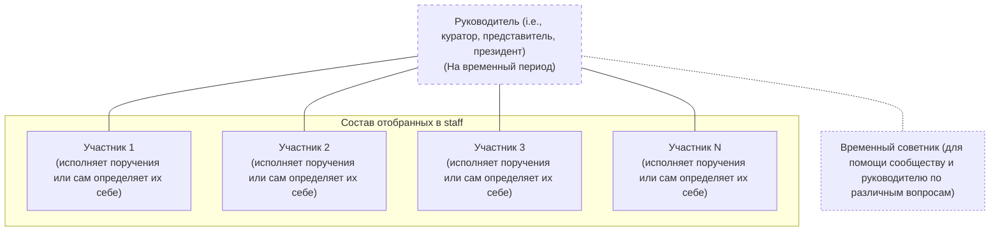

# staff

## Структура управления

Это пока что тестовый вариант на 2026-2027 год, который позже изменится. Потому что финальная цель клуба это выйти за пределы университета как отдельная организация с лишь филиалом в AITU и без потери контроля над наработанными ресурсами. В дальнейшем, стоит попробовать определиться конкретным подходом для ограниченного круга лиц как у нас: прозрачная/открытая коллегия из cpython, работники как инвестора в valve, минимальная бюрократия в процессах тех же стартапов, и минимальная зависимость на outsource то есть проекты делаем все самостоятельно.



## Отбор участников

Отбор будет происходить без закрытия в любое время в 2 этапа (подача заявки в Google Forms и обязательное интервью в живую чтобы понять намерения человека на самом деле). В прошлой анкете Google Forms этапа были такие примерные вопросы:
```
ФИО

Группа

Кем ты видишь себя в клубе и почему

Как ты хочешь помогать клубу по факту

Какие идеи есть для клуба

Контакты для связи
```

Однако, у нас текущая система не работает полноценно из-за того что набранные участники просто не проявляют инициативу, хотя она должна исходить изнутри на самом деле. Например, было видео [про то как оперируют децентрализованные террор. организации](https://youtu.be/3eZrUygPpx8), которые переживают своих лидеров и руководство лишь за счет идеалогии и автономной структуры. На данный момент, публичный офтоп чат CORE работает по таким же принципам, ведь там никого не побуждают общаться насильно, а они сами поддерживают актив изнутри. Перед нами стоит задача как направить неорганизованную массу людей в те задачи которые необходимы для сообщества. По типу не "я жду ответа от руководства или тех кто активно пишет", а "я сам готов предложить свои варианты, обосновать их, рассмотреть трудности, и даже исполнить" в структурированном виде. Поэтому мы пока что будем кикать слабоактивных участников (которые ничего не пишут и игнорят в первую очередь в течении недели ведь у всех сейчас есть телефон и доступ к интернету) и отбирать новых намного внимательнее.

## Участники и их вклад

У нас нету постоянных должностей и ролей в staff, потому что мы мониторим реальную активность и инициативность, то есть не ждать пока заставят а проявлять себя на постоянной основе (например, кидать идеи и делать их мелкие PoC наработки) и также можно выполнять несколько функций одновременно в зависимости от своего опыта и интереса (проводить исследования, организовывать участников и мероприятия, производить медиаконтент и публикации, и многое другое). Важно вести отчетность данной деятельности вместе с доказательствами (что сделано, когда, результаты, подтверждение в виде ссылки/скрина/файла, и другие детали), чтобы потом можно было подавать пруфы на получение соц. gpa в AITU. Когда мы станем организацией вне университета, то тогда будут производиться полноценные выплаты и бонусы участникам. Позже мы будем еще вести онлайн таблицу или самописную базу данных с активностями и событиями, ведь в Github этот момент не совсем удобный и могут излишне сливаться персональные данные.

| Участник | Зона ответственности и деятельности | Статус и история | Публичные контакты |
| --- | --- | --- | --- |
| Ilya K. | Исполняет обязанности "президента" клуба с 2026 по 2027 года. | Активен | @doesnm
| Noyan T. | Выполняет роль советника/помощника и ведет совместную работу с Ilya K. | Активен | @noyantendikov |
| ... | ... | ... | ... |
